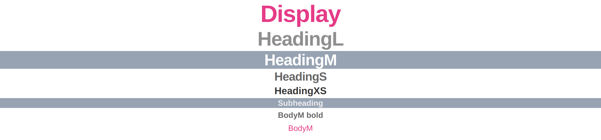

# **Typography - Tipografia**

### **Documentação de uso dos componentes de texto e cores padrão do sistema.**
---

 ## 1.<a name="componentes"></a> Componentes:
Foram desenvolvidos elementos textuais padronizados para utilização no desenvolvimento de páginas e componentes dentro da plataforma.

Neste mesmo diretório, dentro de [/components](./components) você encontrará 7 (sete) componentes de tipografia distintos, separados em pastas individuais, para utilizar na implementação de textos:

- Display:

```html
<Display props>{texto}</Display>
```

`props?: { color: { type:string, default: 'dark-medium' } } `
<br/>
<br/>

- HeadingL:

```html
<HeadingL props>{texto}</HeadingL>
```

`props?: { color: { type:string, default: 'dark-medium' } } `
<br/>
<br/>

- HeadingM:

```html
<HeadingM props>{texto}</HeadingM>
```

`props?: { color: { type:string, default: 'dark-medium' } } `
<br/>
<br/>

- HeadingS:

```html
<HeadingS props>{texto}</HeadingS>
```

`props?: { color: { type:string, default: 'dark-medium' } } `
<br/>
<br/>

- HeadingXS:

```html
<HeadingXS props>{texto}</HeadingXS>
```

`props?: { color: { type:string, default: 'dark-medium' } } `
<br/>
<br/>

- Subheading

```html
<Subheading props>{texto}</Subheading>
```

`props?: { color: { type:string, default: 'dark-medium' } } `
<br/>
<br/>

- BodyM

```html
<BodyM props>{texto}</BodyM>
```

`props?: { color: { type:string, default: 'dark-medium' }, bold: { type:boolean, default: false} } `
<br/>
<br/>

### **1.a. Propriedades dos componentes:**
Todos os componentes de texto permitem a escolha da cor da fonte através do atributo `color` que deve ser passado *dentro da tag* através de uma das strings especificadas na seção [Cores](#cores).

Importante notar que em alguns casos específicos a cor de fundo do elemento textual também é modificada do padrão `#fff` para favorecer o contraste do texto.

Além de `color`, o elemento `<BodyM>` possui a propriedade `bold`, que por padrão possui valor `false` e indica se o texto passado ao elemento será exibido em **negrito**.


---

## 2.<a name="cores"></a> Cores:

 Todos os elementos criados permitem a modificação das cores do texto através da propriedade `color`, 
 
 A propriedade `color` aceita os seguintes valores como válidos, que aplicam as seguintes propriedades de estilo ao componente:

-  `dark-low:`
    ``` css
    color: rgba(0,0,0,0.44);
    ```
-  `dark-medium:`
    ``` css
    color: rgba(0,0,0,0.6);
    ```
-  `dark-high:`
    ``` css
    color: rgba(0,0,0,0.8);
    ```
-  `accent:`
    ``` css
    color: #e63888;
    ```
-  `light-solid:` 
    ``` css
    color: #fff;
    ```
-  `light-solid-bg:` 
    ``` css
    color: #fff; background-color: #97a3b3ff;
    ```
-  `light-high:`
    ``` css
    color: rgba(255,255,255,0.8);
    ```
-  `light-high-bg:`
    ``` css
    color: rgba(255,255,255,0.8); background-color: #97a3b3ff;
    ```

---

## 3. Exemplos:
A seguir, você encontra um exemplo de aplicação para cada um dos [Componentes](#componentes) tipográficos com variadas [Cores](#cores):

``` jsx
import './App.css';
import Display from './typography/components/Display/Display';
import HeadingL from './typography/components/HeadingL/HeadingL';
import HeadingM from './typography/components/HeadingM/HeadingM';
import HeadingS from './typography/components/HeadingS/HeadingS';
import HeadingXS from './typography/components/HeadingXS/HeadingXS';
import Subheading from './typography/components/Subheading/Subheading';
import BodyM from './typography/components/BodyM/BodyM';

function App() {
  return (
    <div className="App">
      <Display color="accent">Display</Display>
      <HeadingL color="dark-low">HeadingL</HeadingL>
      <HeadingM color="light-solid">HeadingM</HeadingM>
      <HeadingM color="light-solid-bg">HeadingM</HeadingM>
      <HeadingS>HeadingS</HeadingS>
      <HeadingXS color="dark-high">HeadingXS</HeadingXS>
      <Subheading color="light-high">Subheading</Subheading>
      <Subheading color="light-high-bg">Subheading</Subheading>
      <BodyM color="dark-medium" bold>BodyM bold</BodyM>
      <BodyM color="accent" >BodyM</BodyM>
    </div>
  );
}

export default App; 
```
